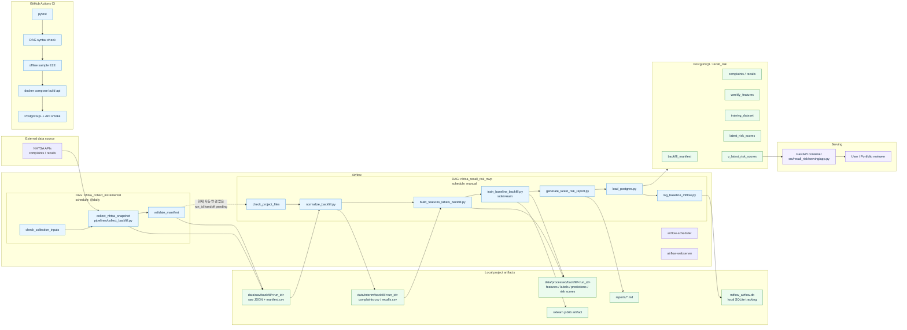
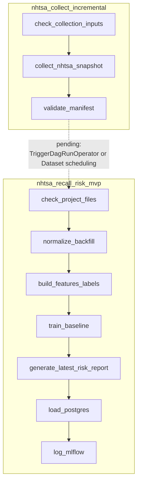
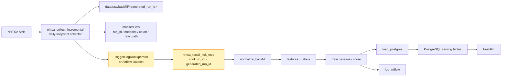
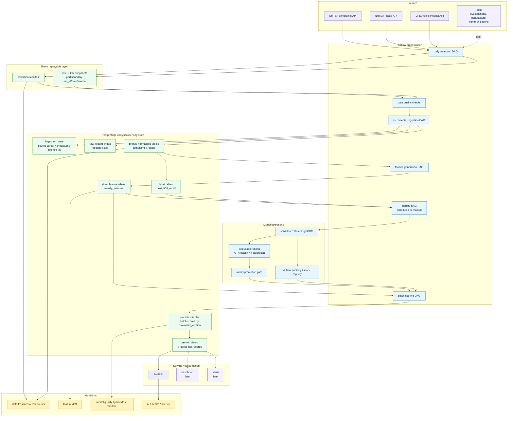
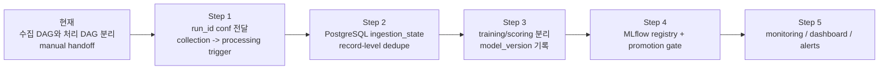

# Architecture Visualization

작성일: 2026-05-31 KST

## 1. 현재 아키텍처

현재 구조는 **수집 DAG**와 **처리/학습 DAG**가 분리되어 있다.

중요한 점:

```text
1. nhtsa_collect_incremental DAG는 live NHTSA API를 호출해서 raw snapshot을 만든다.
2. nhtsa_recall_risk_mvp DAG는 특정 NHTSA_RUN_ID를 기준으로 정규화/feature/학습/적재를 수행한다.
3. 두 DAG 사이의 자동 handoff는 아직 없다.
4. PostgreSQL은 serving용 결과 저장소 역할을 한다.
5. MLflow는 현재 SQLite tracking URI 기반으로 baseline run을 기록한다.
```



## 2. 현재 Airflow DAG 관점

현재 Airflow DAG는 두 개다.



현재 문제는 `nhtsa_recall_risk_mvp`가 환경변수 `NHTSA_RUN_ID`에 고정된 run을 처리한다는 점이다.

```text
현재 기본값: 20260515T114046Z
수집 DAG 최신 산출물 예시: collect_20260525T171005
```

따라서 다음 개선의 첫 번째 핵심은 **수집 DAG가 만든 run_id를 처리 DAG에 전달**하는 것이다.

## 3. 앞으로 바뀌어야 하는 아키텍처: 1차 목표

가장 가까운 목표는 **DAG 간 handoff**다.



필요 변경:

```text
1. nhtsa_recall_risk_mvp가 dag_run.conf["run_id"]를 받도록 수정
2. nhtsa_collect_incremental 마지막 task에서 처리 DAG trigger
3. 처리 DAG의 NHTSA_RUN_ID 고정값 의존 제거
4. run_id별 결과가 PostgreSQL에 적재될 때 metadata를 명확히 남김
```

## 4. 앞으로 바뀌어야 하는 아키텍처: 목표형 MLOps 구조

최종적으로는 CSV 중심 batch artifact 구조에서 **DB/state 중심 incremental MLOps 구조**로 이동해야 한다.



## 5. 현재에서 목표로 가는 단계



우선순위:

| Priority | Change | Why |
|---:|---|---|
| 1 | `dag_run.conf["run_id"]` 기반 처리 DAG 실행 | 수집과 처리 사이의 실제 자동화 연결 |
| 2 | `TriggerDagRunOperator` 또는 Airflow Dataset 적용 | daily collection 이후 자동 후속 처리 |
| 3 | ingestion state/dedupe table 추가 | snapshot 반복 수집에서 true incremental ingestion으로 전환 |
| 4 | prediction/model_version metadata 추가 | 포트폴리오에서 MLOps maturity를 설명 가능 |
| 5 | monitoring 최소 지표 추가 | 운영형 프로젝트로 확장 |

## 6. 한 줄 판단

현재는 다음 상태다.

```text
Airflow + PostgreSQL + FastAPI + MLflow + CI는 붙었다.
하지만 collection과 processing은 아직 자동 연결되지 않았다.
그리고 incremental ingestion은 아직 snapshot collector 수준이다.
```

다음 구현은 다음 하나가 맞다.

```text
nhtsa_recall_risk_mvp를 dag_run.conf["run_id"] 기반으로 바꾸고,
nhtsa_collect_incremental이 성공하면 그 run_id로 처리 DAG를 trigger하게 만든다.
```
