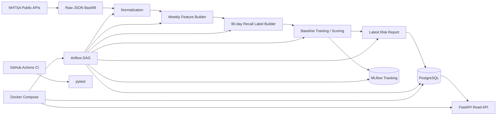

# Portfolio Brief

작성일: 2026-05-23 KST

## 프로젝트명

```text
Vehicle Recall Risk MLOps
```

## 한 줄 소개

미국 NHTSA 공개 데이터를 이용해 차량 리콜 위험 신호를 조기 감지하고, 이를 PostgreSQL, FastAPI, MLflow, Airflow, Docker, CI로 운영화한 MLOps MVP 프로젝트다.

## 왜 이 주제를 선택했나

이 프로젝트는 단순한 분류 모델보다 MLOps 직무 전환에 필요한 전체 흐름을 보여주기 위해 선택했다.

```text
1. 공개 데이터 수집이 가능하다.
2. complaint -> recall이라는 시간 순서가 있어 예측 문제로 만들 수 있다.
3. 리콜은 희소 이벤트라 실제 운영형 ML 문제와 유사하다.
4. 미국 데이터지만 현대/기아 등 글로벌 제조사도 포함된다.
5. 백엔드 경험을 API, DB, orchestration, CI 쪽으로 연결해 설명하기 좋다.
```

## 문제 정의

관측 단위:

```text
make / model / model_year / component / week
```

입력 신호:

```text
NHTSA consumer complaints
NHTSA recalls
vehicle metadata
```

label:

```text
해당 주차 이후 90일 안에 관련 recall이 발생하는가
```

현재 score:

```text
complaint spike 기반 위험 신호 점수
```

주의:

```text
현재 score는 보정된 리콜 발생 확률이 아니다.
MVP에서는 희소 이벤트의 조기 탐지/랭킹 문제로 다룬다.
```

## 현재 아키텍처



## 검증된 MVP 범위

현재 로컬에서 검증한 범위:

```text
raw backfill data 재처리
정규화
weekly feature 생성
90일 recall label 생성
baseline scoring
latest risk report 생성
PostgreSQL 적재
FastAPI 조회
MLflow metric/artifact 기록
Airflow DAG end-to-end 실행
API Docker container 실행
pytest 기반 CI scaffold
```

Airflow E2E DAG:

```text
normalize_backfill
-> build_features_labels
-> train_baseline
-> generate_latest_risk_report
-> load_postgres
-> log_mlflow
```

## 주요 결과

기준 run:

```text
20260515T114046Z
```

데이터 규모:

| 항목 | 값 |
|---|---:|
| vehicle-year candidates | 917 |
| complaints rows | 103,440 |
| recalls rows | 3,018 |
| weekly feature rows | 1,189,569 |
| label-ready rows | 1,172,332 |
| positive rows | 4,348 |
| baseline test rows | 293,083 |

평가 metric:

| metric | value |
|---|---:|
| rule average precision | 0.006281 |
| logistic average precision | 0.008191 |

최신 risk week:

```text
2026-05-11
```

API 예시 결과:

| rank | make | model | model_year | component | score |
|---:|---|---|---:|---|---:|
| 1 | FORD | BRONCO SPORT | 2021 | UNKNOWN OR OTHER | 2.8062 |
| 2 | FORD | BRONCO SPORT | 2022 | ENGINE | 2.4749 |
| 3 | FORD | ESCAPE | 2015 | POWER TRAIN | 2.4749 |

## 기술 스택

| 영역 | 기술 |
|---|---|
| Data source | NHTSA public APIs |
| Data processing | Python, pandas |
| ML baseline | scikit-learn Pipeline, LogisticRegression |
| Storage | PostgreSQL |
| Serving | FastAPI |
| Experiment tracking | MLflow |
| Orchestration | Apache Airflow |
| Runtime | Docker Compose |
| CI | GitHub Actions, pytest |

## 면접에서 설명할 포인트

### 1. 노트북이 아니라 운영 흐름을 만들었다

데이터 수집/정규화, feature/label 생성, 모델 평가, DB 적재, API 제공, 실험 기록, orchestration까지 분리된 스크립트와 서비스로 구성했다.

### 2. 백엔드 경험을 MLOps로 연결했다

PostgreSQL schema, FastAPI read API, Docker Compose, CI, Airflow orchestration은 백엔드 개발 경험과 직접 연결된다. 여기에 MLflow와 feature/label pipeline을 붙여 MLOps 흐름으로 확장했다.

### 3. 성능보다 문제 설정과 반복 가능한 파이프라인을 우선했다

리콜은 매우 희소한 이벤트라 정확도보다 ranking metric인 average precision을 사용했다. MVP에서는 모델 성능을 과장하지 않고, baseline을 기준으로 개선 여지를 명확히 남겼다.

### 4. 데이터 한계를 명시했다

현재 Airflow E2E는 기존 raw backfill 데이터를 재처리한다. NHTSA API collect_backfill 자체는 구현되어 있지만, 이번 Airflow E2E DAG에는 포함하지 않았다. 장기 운영 단계에서는 incremental collector를 별도 DAG/task로 분리하는 것이 맞다.

## 현재 한계

```text
1. 모델은 baseline 수준이다.
2. score는 calibration된 recall probability가 아니다.
3. component matching과 make/model alias 정규화는 개선 여지가 있다.
4. Airflow E2E는 기존 raw backfill 재처리 기준이다.
5. GitHub Actions 원격 green 여부는 별도 확인이 필요하다.
6. 운영 배포, registry, secret management는 아직 범위 밖이다.
```

## 다음 개선 후보

우선순위가 높은 순서:

```text
1. calibration / top-K ranking 개선
2. LightGBM/XGBoost 같은 tree-based model 비교
3. collect_backfill / incremental collector를 Airflow DAG에 추가
4. CI에서 Docker build 검증 추가
5. component normalization / recall matching 품질 개선
6. README 정식 개편
```

## 포트폴리오용 결론 문장

```text
Vehicle Recall Risk MLOps는 NHTSA 공개 데이터를 사용해 차량 리콜 위험 신호를 생성하고,
PostgreSQL 적재, FastAPI serving, MLflow tracking, Airflow orchestration,
Docker 실행, GitHub Actions CI까지 연결한 end-to-end MLOps MVP입니다.
```
